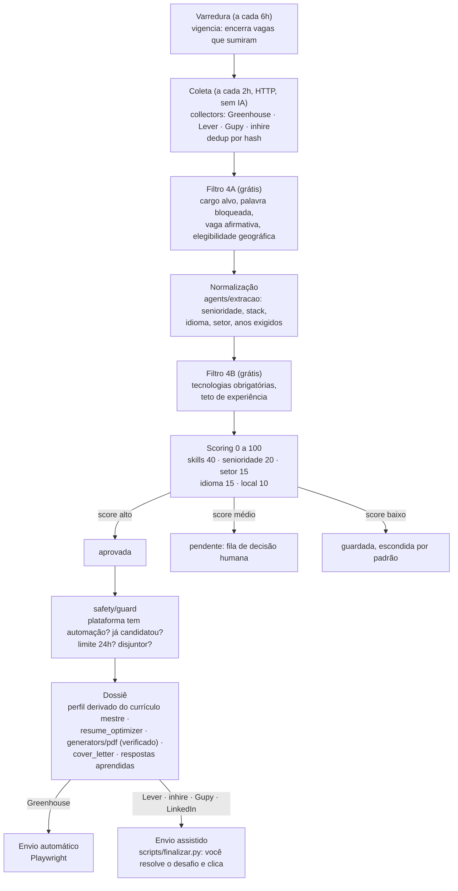

# AI Job Applier

> Pipeline local de candidaturas assistidas por IA para vagas de dados no Brasil: coleta vagas em Greenhouse, Lever, Gupy e inhire, filtra e pontua contra o seu currículo, monta um dossiê por vaga (currículo otimizado para ATS e cover letter) e automatiza o envio onde isso é seguro.


## 🇺🇸 English summary

- Personal job-application pipeline for data roles in Brazil. Collectors pull openings from Greenhouse, Lever, Gupy and inhire through their public APIs; two free filtering stages discard most of them before any LLM call; a scoring step ranks the rest against the candidate's structured résumé.
- For approved openings the system builds a dossier: a résumé re-ordered and rephrased for ATS (never inventing facts), a cover letter in the job's language, and pre-filled answers to recurring form questions. Submission is automated only where it is safe (Greenhouse); elsewhere the tool prepares everything and the human clicks send.
- Engineering highlights: provider-agnostic LLM layer with caching, retry and fallback; a safety module with sliding 24-hour limits, dedup and circuit breaker that every application path must pass through; PDF output rendered to images and geometry-checked before it can be sent; three test layers (unit, Playwright against local fixtures, opt-in live); CI with ruff, pytest and a check that no personal data is versioned.
- Everything runs on the user's machine; personal data lives in an ignored `data/` folder and secrets in `.env`.

## O problema

- Candidatar-se a vagas é maçante: centenas de anúncios parecidos, formulários repetitivos e currículo genérico que o ATS descarta.
- Automatizar tudo cegamente é pior: viola termos de uso, queima a conta profissional e envia candidaturas indevidas. Volume não é sucesso.
- O objetivo é reduzir o tédio sem mentir no currículo e sem arriscar a conta: menos candidaturas, melhores, com um dossiê pronto para cada uma.

## A solução



- **Gastar LLM o mais tarde possível.** Cada etapa descarta vagas antes da etapa mais cara. Hoje o pipeline roda inteiro em modo determinístico; o LLM é opcional e entra onde de fato agrega (reescrever resumo e bullets com o vocabulário da vaga).
- **Score nunca rejeita.** Abaixo do corte a vaga vira possibilidade guardada, não lixo. Automação só acima de um segundo corte, mais alto.
- **Tratamento por plataforma é deliberado.** Greenhouse tem formulário público sem CAPTCHA e recebe envio automático. Lever e inhire têm CAPTCHA medido no formulário, Gupy tem Turnstile no login e o LinkedIn arrisca a conta: nesses casos o sistema prepara tudo e a pessoa envia.

## Destaques técnicos

- **Invariantes escritas e testadas.** Regras como "todo caminho de candidatura passa pelo guard antes de gastar qualquer recurso", "o sistema nunca afirma o que o currículo não sustenta" e "segredo e PII nunca entram em log" estão documentadas em `CLAUDE.md`, cada uma com o bug real que a motivou e o teste que falha se ela for removida.
- **Camada de LLM agnóstica.** `jobapplier/llm` expõe um contrato único para OpenAI, Gemini e Anthropic com modo JSON nativo por provedor, cache em banco com TTL, retry com backoff em rate limit, cadeia de fallback entre provedores e importação tardia dos SDKs (só o provedor configurado precisa estar instalado). Trocar de provedor é configuração, não código.
- **Controle de risco de verdade.** Janela deslizante de 24 horas por plataforma (não dia-calendário), disjuntor por excesso de erros, dedup por hash e liberação de tarefas órfãs. O LinkedIn é sempre o limite mais restritivo, e há teste garantindo isso.
- **Currículo com fonte única.** Fatos (empresa, cargo, datas, formação, contato) moram só no currículo mestre; perfis por vaga são derivados e só podem trocar resumo e ordem de tecnologias. Um teste falha se qualquer perfil divergir do mestre em fato.
- **PDF que se prova antes de sair.** Todo currículo gerado é renderizado em imagem e passa por checagem automática de geometria. Problema grave levanta exceção e a candidatura não sai: falha fechada.
- **Saída de LLM nunca vira artefato sem normalização.** Tudo que cruza para arquivo, formulário ou banco passa por normalização ou validação Pydantic.
- **Banco de respostas aprendidas.** O que você digita à mão uma vez o sistema repete, com escopo por classe de pergunta (fato global, pergunta aberta por empresa), casamento exato e revisão na interface. Memória só é aceitável se for revisável.
- **Extensão de navegador e API local.** Uma extensão identifica a candidatura aberta no navegador e conversa com uma API em `127.0.0.1`, que resolve a vaga da certeza para a dúvida e nunca deduz por título.
- **Três camadas de teste.** Unitários sem rede nem banco; Playwright real contra fixtures HTML locais que reproduzem o comportamento do react-select (a camada que pega quebra de seletor); e testes `live` opt-in que só navegam, nunca enviam. `--strict-markers` ativo.
- **CI honesto.** Ruff, pytest e uma verificação de que nada de `data/` ou `.env` foi versionado.
- **Frontend descartável por design.** A interface Streamlit não contém regra de negócio; toda alteração visual passa por captura de tela automatizada e avaliação de layout antes de ser dada como pronta.

## Stack

- **Linguagem:** Python 3.12.
- **Dados:** PostgreSQL 16 (Docker), SQLAlchemy 2 (estilo `Mapped`), Alembic, APScheduler com jobstore no Postgres.
- **LLM:** `openai`, `google-genai`, `anthropic`, atrás de uma abstração própria.
- **Automação:** Playwright (API sync), extensão de navegador em JavaScript.
- **Currículo:** Pydantic 2, pdfplumber, python-docx, xhtml2pdf.
- **Interface:** Streamlit.
- **Qualidade:** pytest, ruff, GitHub Actions.

## Estrutura do repositório

```
run.py                   → único entry point: sobe Postgres, interface e orquestrador
jobapplier/              → domínio (nada de UI aqui)
  orchestrator.py        → agendamento e as três esteiras do pipeline
  collectors/            → Greenhouse, Lever, Gupy, inhire (APIs REST, sem browser)
  filters/               → 4A pré-normalização, 4B pós-normalização
  agents/                → extração, scorer, resume_optimizer, cover_letter, respostas
  llm/                   → abstração de provedor: cache, retry, fallback
  applicators/           → Greenhouse, Gupy, LinkedIn via Playwright
  safety/                → limites, delays, dedup, disjuntor
  resume_parser/         → PDF/DOCX para JSON estruturado
  generators/            → JSON para PDF, com preview e verificação
  database/              → models, repositórios, migrations Alembic
  config/                → configuração e segredos (.env)
  api.py · aprendizado.py · perfis.py · vigencia.py · elegibilidade.py ...
ui/                      → Streamlit (descartável por design)
extensao/                → extensão de navegador que conversa com a API local
tests/                   → unit · e2e (fixtures locais) · integration (banco)
scripts/                 → instalação, varredura, panorama, sessão assistida, backup
docs/                    → especificação original, régua de UI, prompts de revisão
```

## Como executar

**Requisitos:** Python 3.12+, Docker Desktop (para o PostgreSQL) e, opcionalmente, uma chave de API de um provedor de LLM.

```powershell
git clone https://github.com/RicardoInoue95/ai-job-applyer.git
cd ai-job-applyer
.\scripts\install.ps1            # venv, dependências, Chromium do Playwright, .env
```

Ou manualmente:

```powershell
python -m venv .venv
.venv\Scripts\python.exe -m pip install -r requirements.txt
.venv\Scripts\python.exe -m playwright install chromium
copy .env.example .env
```

Preencha o `.env` com a chave de um provedor (basta uma; sem chave, o pipeline roda em modo determinístico):

| Provedor | Variável |
|---|---|
| OpenAI | `AIJOB_OPENAI_API_KEY` |
| Gemini | `AIJOB_GEMINI_API_KEY` |
| Anthropic | `AIJOB_ANTHROPIC_API_KEY` |

```powershell
python run.py                    # Postgres + interface + orquestrador em http://localhost:8501
```

Siga o assistente: provedor de IA, currículo, preferências de busca, plataformas. Depois o orquestrador coleta a cada 2 horas, pontua e prepara o dossiê do que passar dos seus critérios. Vagas de score intermediário esperam sua decisão na aba Vagas.

**Desenvolvimento**

```powershell
.venv\Scripts\python.exe -m pytest tests/unit        # rápidos, sem rede nem banco
.venv\Scripts\python.exe -m pytest                   # + e2e com Playwright local
.venv\Scripts\python.exe -m pytest -m live           # toca rede, só sob demanda
.venv\Scripts\python.exe -m ruff check .
```

Convenções, invariantes e armadilhas conhecidas estão em [CLAUDE.md](CLAUDE.md). A especificação original, com a numeração de módulos que o código referencia, está em [docs/initial_plan.md](docs/initial_plan.md).

## Status e roadmap

- **Funciona:** coleta nas quatro plataformas, filtros, normalização e score determinísticos, dossiê com currículo e cover letter, envio automático no Greenhouse, sessão assistida nas demais, banco de respostas, extensão de navegador, varredura de vagas encerradas, backups.
- **Em evolução:** camada `services/` compartilhada entre interface e orquestrador, credenciais cifradas, tabela de eventos para correlacionar score com desfecho real (resposta, entrevista, oferta).
- **Limitações conhecidas:** instalação Windows-first; dependências sem lockfile; filtro de senioridade do 4B ainda não implementado por decisão explícita (exige definir a política).

## Aviso de uso responsável

- Ferramenta de uso pessoal, usuário único. Roda na sua máquina, com seus dados no seu disco.
- Automatizar o Easy Apply do LinkedIn viola o User Agreement da plataforma e pode levar à restrição permanente da conta. O suporte ao LinkedIn é opt-in, vem desligado e o núcleo funciona sem ele.
- Onde há CAPTCHA ou termos que proíbem automação, o sistema prepara e a pessoa envia.
- O otimizador de currículo nunca inventa experiência, cargo, data, certificação ou tecnologia.

## Licença

Código sob licença [MIT](LICENSE).

## Autor

Ricardo Inoue · [GitHub](https://github.com/RicardoInoue95) · LinkedIn: <linkedin-url>
